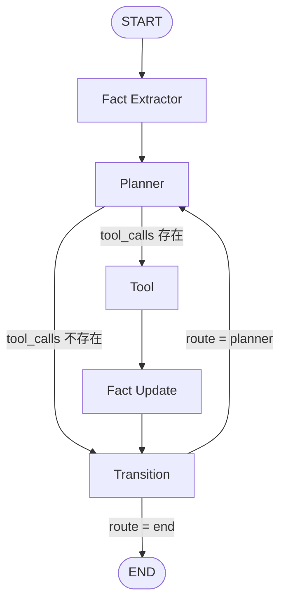
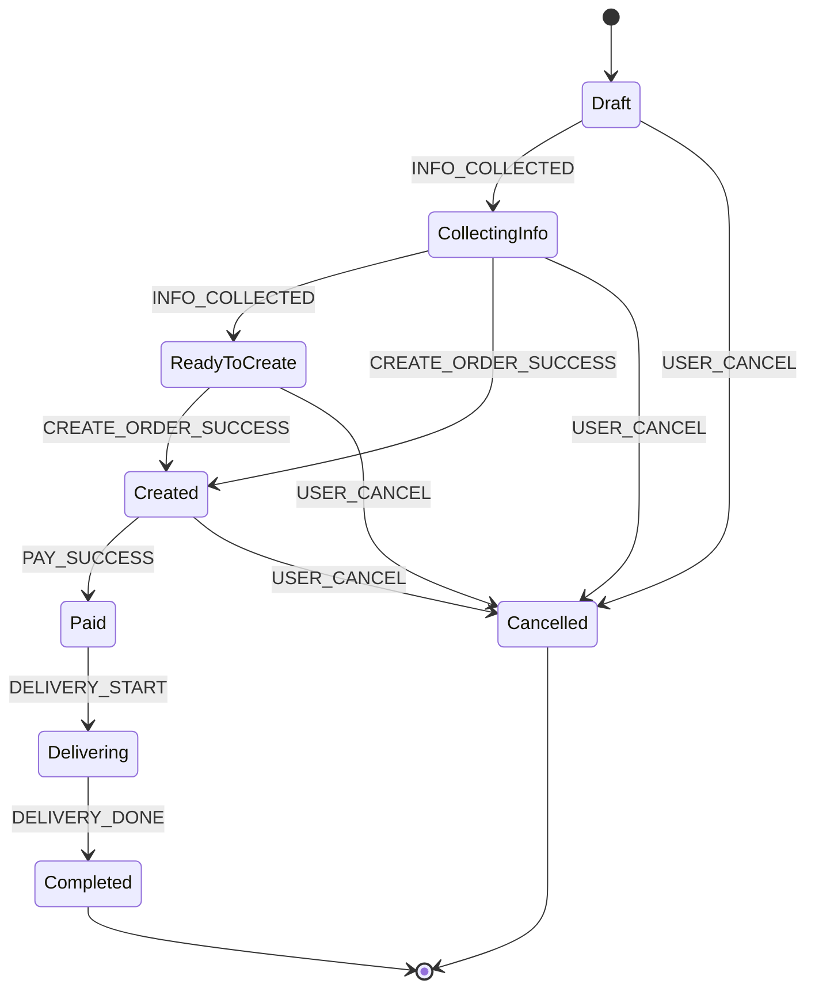

# Agent Graph

## 五大节点流程图

说明:
- Fact Extractor: 解析用户输入并写入事实，预算规则抽取失败时走预算意图补齐。
- Planner: 调用主模型进行规划，决定是否发起 tool 调用。
- Tool: 执行 MCP 工具调用，收集 tool payload。
- Fact Update: 处理 tool 返回中的 updateFacts，写回事实层。
- Transition: 基于事件和状态表做流转，判定继续规划或结束。

## 订单状态流转图

事件来源:
- USER_CANCEL: 用户输入命中取消语义。
- CREATE_ORDER_SUCCESS / PAY_SUCCESS / DELIVERY_START / DELIVERY_DONE: 由 Tool 节点执行到的工具名推断。
- INFO_COLLECTED: 在 Draft/CollectingInfo 阶段且无更强事件时触发。

