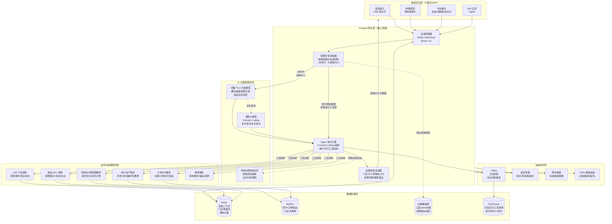
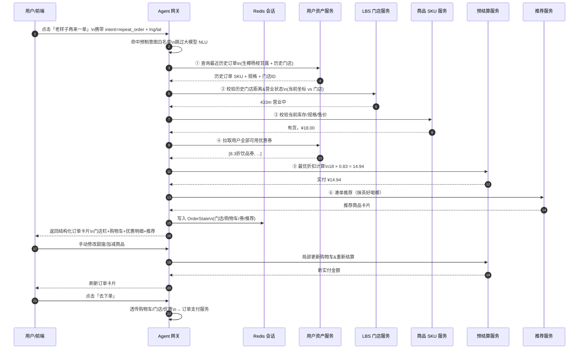
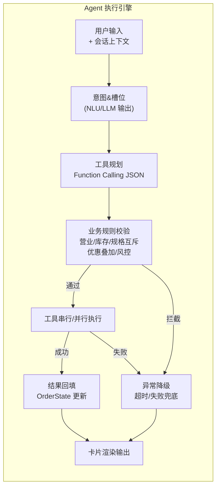
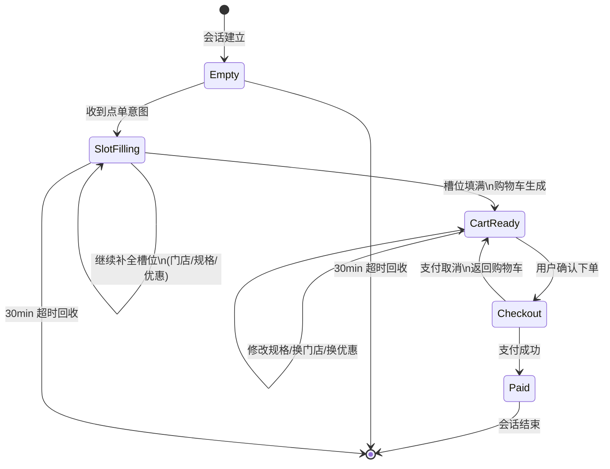
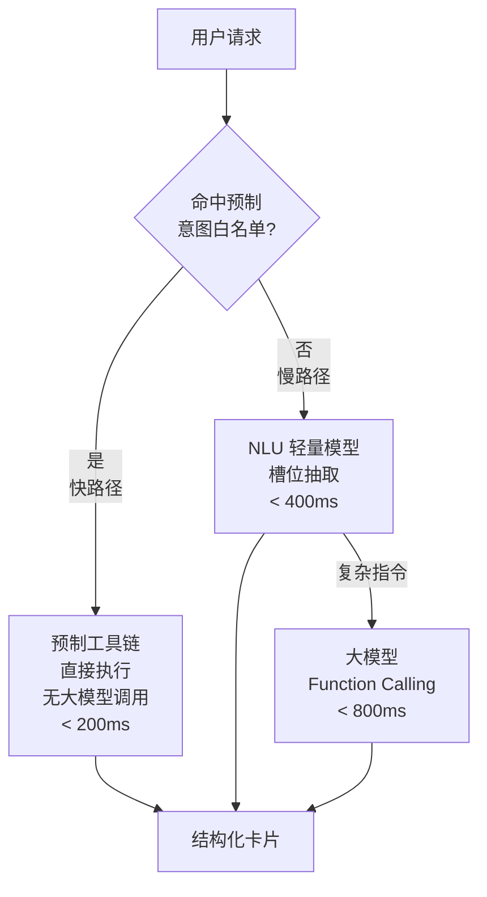

# 瑞幸咖啡 AI 点单 Agent 架构图

## 一、整体分层架构

```mermaid
flowchart TD
    subgraph FE["前端交互层（小程序/APP）"]
        V["语音输入\nASR 转文字"]
        BTN["快捷按钮\n预制意图ID"]
        MANUAL["手动操作\n加减/改规格/换支付"]
        LBS_CLIENT["LBS 定位\nlng/lat"]
    end

    subgraph GW["AI Agent 网关层（核心调度）"]
        SESSION["会话管理器\nRedis OrderState\n30min TTL"]
        DISPATCHER["意图分发调度器\n快捷意图白名单匹配\n↓未命中→大模型NLU"]
        ENGINE["Agent 执行引擎\nFunction Calling 编排\n串行/并行工具调用"]
        RENDERER["结果组装渲染器\n门店卡片/购物车卡片\n优惠明细/推荐商品"]
    end

    subgraph AI["AI 大模型服务层"]
        NLU["轻量 NLU 分类模型\n槽位抽取/意图分类\n低延迟高并发"]
        LLM["通用大模型\nFunction Calling\n复杂多轮/复合指令"]
        DICT["词库&规则知识库\n规格别名映射\n业务约束规则"]
    end

    subgraph BIZ["业务中台微服务层"]
        LBS_SVC["LBS 门店服务\n距离排序/营业状态"]
        SKU_SVC["商品 SKU 服务\n规格/售价/库存/活动"]
        ASSET_SVC["用户资产服务\n历史订单/偏好/优惠券"]
        CART_SVC["购物车&预结算服务\n最优折扣/实付计算"]
        ORDER_SVC["订单支付服务\n创建订单/支付拉起"]
        REC_SVC["推荐服务\n凑单推荐/新品/招牌"]
    end

    subgraph STORE["数据存储层"]
        REDIS[("Redis\n会话上下文\n门店/券缓存\n限购计数")]
        MYSQL[("MySQL\n用户/订单/商品\n门店/优惠券")]
        VECTOR[("向量数据库\n口语query向量\n意图相似检索")]
        CK[("ClickHouse\n对话日志/工具调用\n转化率/NLU迭代")]
    end

    subgraph OPS["运维中间件"]
        KAFKA["Kafka\n日志采集\n活动消息推送"]
        MONITOR["监控告警\n耗时/失败率/超时"]
        RATELIMIT["限流熔断\n高峰降级策略"]
        APM["APM 链路追踪\n全链路耗时定位"]
    end

    %% 前端 → 网关
    V & BTN & MANUAL & LBS_CLIENT --> SESSION
    SESSION --> DISPATCHER
    DISPATCHER -->|"命中预制意图\n直接执行工具链"| ENGINE
    DISPATCHER -->|"未命中\n调用NLU"| NLU
    NLU --> ENGINE
    NLU -.->|"复杂多轮"| LLM
    LLM --> ENGINE
    ENGINE -.->|"规格约束校验"| DICT

    %% 网关 → 中台
    ENGINE -->|"工具调用"| LBS_SVC
    ENGINE -->|"工具调用"| SKU_SVC
    ENGINE -->|"工具调用"| ASSET_SVC
    ENGINE -->|"工具调用"| CART_SVC
    ENGINE -->|"工具调用"| ORDER_SVC
    ENGINE -->|"工具调用"| REC_SVC

    %% 中台 → 存储
    SESSION <--> REDIS
    LBS_SVC & SKU_SVC --> REDIS
    ASSET_SVC --> MYSQL
    CART_SVC --> REDIS
    ORDER_SVC --> MYSQL
    DISPATCHER -.->|"相似意图检索"| VECTOR

    %% 组装 → 前端
    ENGINE --> RENDERER
    RENDERER -->|"结构化卡片数据"| FE

    %% 日志&监控
    ENGINE --> KAFKA
    KAFKA --> CK
    GW --> MONITOR
    GW --> RATELIMIT
    GW --> APM
```

---

## 二、「老样子再来一单」核心链路

```mermaid
sequenceDiagram
    autonumber
    participant U as 用户/前端
    participant GW as Agent 网关
    participant CACHE as Redis 会话
    participant ASSET as 用户资产服务
    participant LBS as LBS 门店服务
    participant SKU as 商品 SKU 服务
    participant CART as 预结算服务
    participant REC as 推荐服务

    U->>GW: 点击「老样子再来一单」\n携带 intent=repeat_order + lng/lat
    GW->>GW: 命中预制意图白名单\n跳过大模型 NLU
    GW->>ASSET: ① 查询最近历史订单\n(生椰杨枝甘露 + 历史门店)
    ASSET-->>GW: 历史订单 SKU + 规格 + 门店ID
    GW->>LBS: ② 校验历史门店距离&营业状态\n(当前坐标 vs 门店)
    LBS-->>GW: 433m 营业中
    GW->>SKU: ③ 校验当前库存/规格/售价
    SKU-->>GW: 有货，¥18.00
    GW->>ASSET: ④ 拉取用户全部可用优惠券
    ASSET-->>GW: [8.3折饮品券, ...]
    GW->>CART: ⑤ 最优折扣计算\n18 × 0.83 = 14.94
    CART-->>GW: 实付 ¥14.94
    GW->>REC: ⑥ 凑单推荐（抹茶好喝椰）
    REC-->>GW: 推荐商品卡片
    GW->>CACHE: 写入 OrderState\n(门店/购物车/券/推荐)
    GW-->>U: 返回结构化订单卡片\n门店栏+购物车+优惠明细+推荐
    U->>GW: 手动修改甜度/加减商品
    GW->>CART: 局部更新购物车&重新结算
    CART-->>GW: 新实付金额
    GW-->>U: 刷新订单卡片
    U->>GW: 点击「去下单」
    GW->>GW: 透传购物车/门店/优惠\n→ 订单支付服务
```

---

## 三、Agent 执行引擎内部结构

```mermaid
flowchart LR
    subgraph ENGINE["Agent 执行引擎"]
        INPUT["用户输入\n+ 会话上下文"]
        INTENT["意图&槽位\n(NLU/LLM 输出)"]
        PLAN["工具规划\nFunction Calling JSON"]
        GUARD["业务规则校验\n营业/库存/规格互斥\n优惠叠加/风控"]
        EXEC["工具串行/并行执行"]
        MERGE["结果回填\nOrderState 更新"]
        RENDER["卡片渲染输出"]
        FALLBACK["异常降级\n超时/失败兜底"]
    end

    INPUT --> INTENT --> PLAN --> GUARD
    GUARD -->|"通过"| EXEC
    GUARD -->|"拦截"| FALLBACK
    EXEC -->|"成功"| MERGE --> RENDER
    EXEC -->|"失败"| FALLBACK
    FALLBACK --> RENDER
```

---

## 四、状态机：订单会话生命周期

```mermaid
stateDiagram-v2
    [*] --> Empty: 会话建立

    Empty --> SlotFilling: 收到点单意图
    SlotFilling --> SlotFilling: 继续补全槽位\n(门店/规格/优惠)
    SlotFilling --> CartReady: 槽位填满\n购物车生成

    CartReady --> CartReady: 修改规格/换门店/换优惠
    CartReady --> Checkout: 用户确认下单

    Checkout --> Paid: 支付成功
    Checkout --> CartReady: 支付取消\n返回购物车

    Paid --> [*]: 会话结束
    Empty --> [*]: 30min 超时回收
    SlotFilling --> [*]: 30min 超时回收
```

---

## 五、快慢路径分离策略

```mermaid
flowchart TD
    REQ["用户请求"] --> MATCH{"命中预制\n意图白名单?"}

    MATCH -->|"是\n快路径"| FAST["预制工具链\n直接执行\n无大模型调用\n< 200ms"]
    MATCH -->|"否\n慢路径"| SLOW["NLU 轻量模型\n槽位抽取\n< 400ms"]
    SLOW -->|"复杂指令"| LLM_CALL["大模型\nFunction Calling\n< 800ms"]

    FAST --> RESULT["结构化卡片"]
    SLOW --> RESULT
    LLM_CALL --> RESULT
```
