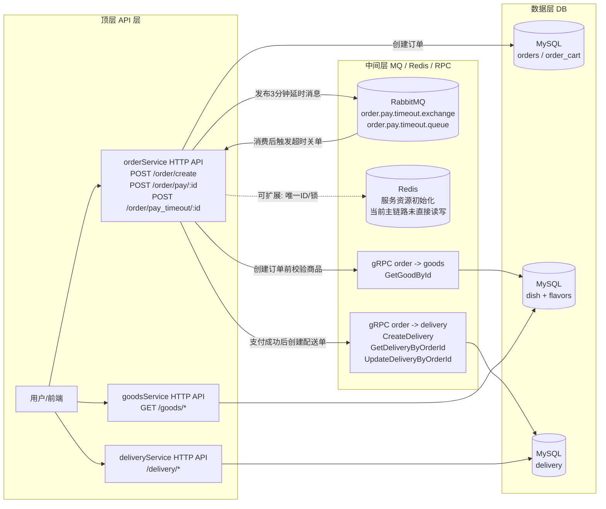
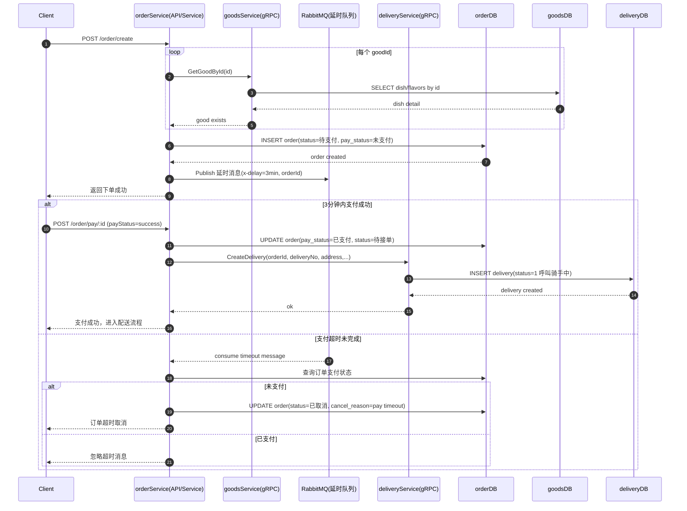

# 下单到商品到物流调用流程图

下面基于当前代码实现整理，重点覆盖「下单 -> 支付 -> 派送」主链路，并按 API => MQ/Redis/RPC => DB 分层。

## 1) 分层总览（API => MQ/Redis/RPC => DB）

## 2) 主流程时序图（下单 -> 支付 -> 派送）

## 3) 补充说明

- 订单号当前由 orderService 本地 Snowflake 生成（非 Redis 自增）。
- Redis 在三个服务中已完成资源初始化，但在上述主链路里没有直接读写语句。
- 退款链路会调用 deliveryService：GetDeliveryByOrderId / UpdateDeliveryByOrderId，并更新订单为 refunded（不属于本次“下单->支付->派送”主路径）。
